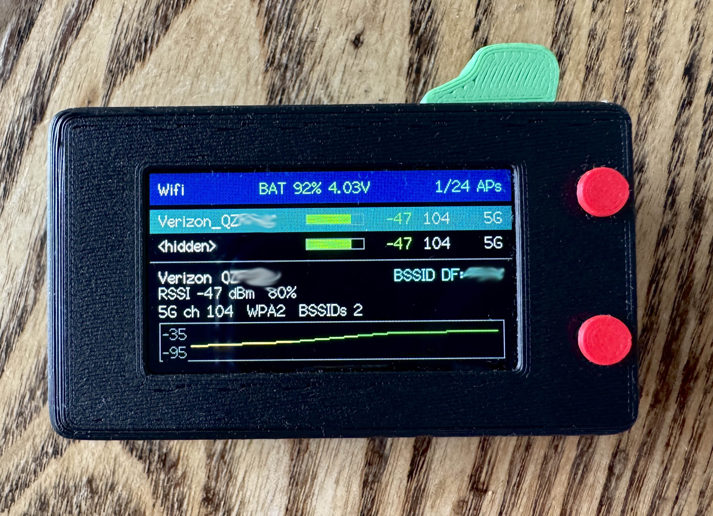
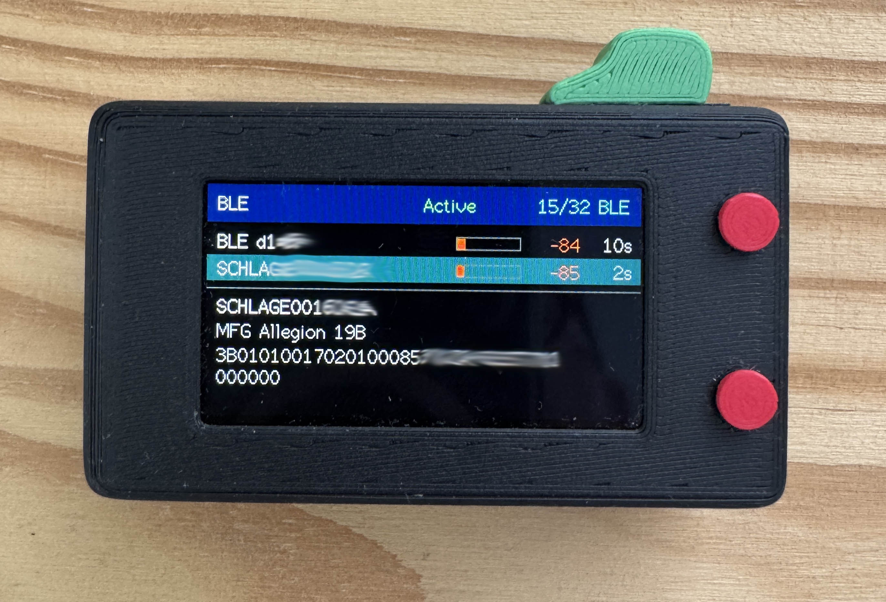
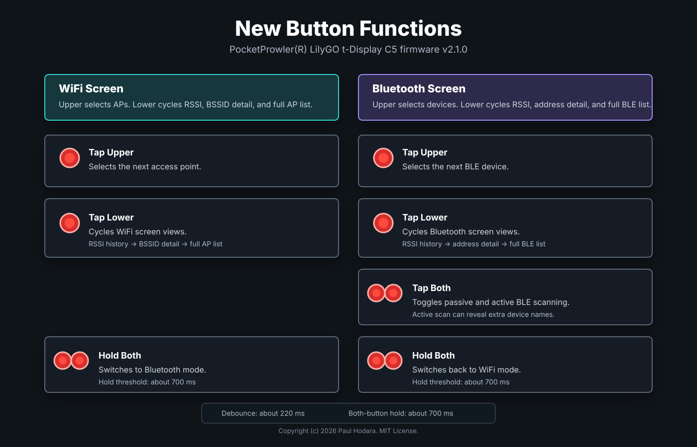

<!-- Copyright (c) 2026 Paul Hodara. MIT License. -->

# PocketProwler - LilyGO T-Display C5 WiFi and Bluetooth Scanner
A portable WiFi + BLE analyzer for the LilyGO T-Display C5.

PocketProwler turns the LilyGO T-Display C5 (ESP32-C5) into a self-contained handheld scanner. Scan nearby WiFi networks and Bluetooth LE devices, drill into per-device detail views, and run for hours on an internal LiPo battery — all inside a 3D-printed case.

<p align="center">
  

  

## Quick Start (No Build Required)

Each [release](https://github.com/phodara/LilygoTDisplayC5/releases/latest)
includes prebuilt firmware — no PlatformIO or toolchain needed.

1. Download **`firmware.factory.bin`** from the latest release.
2. Connect the T-Display C5 via USB-C.
3. Flash it with [esptool](https://docs.espressif.com/projects/esptool/):

```
pip install --upgrade esptool
esptool.py --chip esp32c5 --port /dev/ttyACM0 write_flash 0x0 firmware.factory.bin
```

On Windows the port will be something like `COM5`. If flashing doesn't
start, hold **BOOT**, tap **RST**, release **RST**, then release **BOOT**.

The factory image contains everything (bootloader, partition table, and
app), so it always flashes at offset `0x0` and works for both fresh
installs and updates.


## 3D-Printed Case

A purpose-built enclosure for PocketProwler — with an internal 3000mAh LiPo,
hardware power switch, and printed button caps — is available on 

MakerWorld:
**[LilyGO T-Display C5 Case + LiPo →](https://makerworld.com/en/models/3219883-lilygo-t-display-c5-case-lipo)**
<P>The download includes a Bambu Studio 3MF profile, individual STLs, and a PDF
bill of materials with wiring and assembly instructions.

Printables:
**[LilyGO T-Display C5 Case + LiPo →](https://www.printables.com/model/1824593-case-for-lilygo-t-display-c5-3000-mah-lipo)**
<P>The download includes individual STLs, and a PDF
bill of materials with wiring and assembly instructions.

and Thingiverse:
**[LilyGO T-Display C5 Case + LiPo →](https://www.thingiverse.com/thing:7401376)**
<P>The download includes individual STLs, and a PDF
bill of materials with wiring and assembly instructions.


</p>

## What It Does

- Scans nearby WiFi networks every few seconds.
- Scans nearby Bluetooth devices in a separate screen with passive and active options.
- Shows SSID, RSSI, signal bar, channel, band, and security.
- Draws a compact RSSI history graph for the selected access point.
- Scans Bluetooth Low Energy devices in a separate Bluetooth mode.
- Supports passive and active BLE scan modes.
- Keeps intermittent BLE devices visible briefly after their last advertisement.
- De-duplicates named BLE devices that rotate addresses.
- Reduces display flicker by redrawing only changed screen regions.
- Uses the upper button to scroll through the current WiFi/BLE list.
- Uses the lower button to cycle RSSI history, detail, and full list views for the highlighted WiFi or BLE item.
- Uses both buttons held together to switch between WiFi and Bluetooth modes.
- Prints the scan table to Serial Monitor.

Passive WiFi scans can see RSSI, channel, band, security, and the number of BSSIDs sharing a channel, but they do not reliably expose internet throughput or AP channel width. The display therefore shows same-channel BSSID count as the practical crowding indicator and marks raw scan bandwidth as `n/a`.


## Version 2.2 Improvements

Version 2.2 polishes the pocket scanner display and adds richer BLE advertisement details:

- Battery percentage monitoring is steadier, with sampled readings, charge-current hysteresis, near-full correction, and reboot reuse of the last stable percent.
- The top header now carries a cleaner WiFi/BLE status layout plus battery voltage.
- BLE detail mode adds address type, manufacturer/company hints, advertised service UUID hints, and a manufacturer-data hex panel.
- WiFi detail mode uses clearer WPA/WPA2 security labels.

### Button Controls


## Feature Notes

- [Changelog](CHANGELOG.md)
- [Bluetooth feature plan](docs/bluetooth-feature.md)
- [Bluetooth scanner feature plan](docs/bluetooth-scanner.md)
- [Battery recommendations](docs/battery-recommendations.md)
- [Button commands](docs/button-commands.md)
- [Display flicker fix](docs/display-flicker-fix.md)
- [Display power management](docs/display-power-management.md)
- [RSSI reference](docs/rssi-reference.md)
- [Scan data export idea](docs/scan-data-export.md)
- [WiFi region behavior](docs/wifi-region-behavior.md)
- [WiFi security labels](docs/wifi-security-labels.md)
- [WiFi vendor lookup notes](docs/wifi-vendor-lookup.md)

## Build

```sh
pio run
```

## Upload

```sh
pio run --target upload
```

If upload does not start automatically, hold `BOOT`, tap `RST`, release `RST`, then release `BOOT`.

## Monitor

```sh
pio device monitor
```

## Release Helper

After updating code and documentation for a new version, the reusable release helper can commit, tag, and push the staged release files:

```sh
./scripts/release.sh v2.2.0 "Release v2.2.0 display and BLE data refinements"
```

The script expects a semantic version tag such as `v2.2.0`. Edit `scripts/release.sh` if a future release needs to include different files.

## License

Copyright (c) 2026 Paul Hodara.

This project is licensed under the MIT License. See [LICENSE](LICENSE).

## Key Pins

| Function | GPIO |
| --- | ---: |
| LCD SCK | 7 |
| LCD MOSI | 9 |
| LCD CS | 26 |
| LCD DC | 8 |
| LCD RST | 23 |
| LCD Backlight | 25 |
| I2C SDA | 2 |
| I2C SCL | 3 |
| Top Button Previous | 0 |
| Top Button Next | 28 |
| Touch INT | 27 |
| Touch RST | 24 |

The pin values are kept in `include/pin_config.h`.
